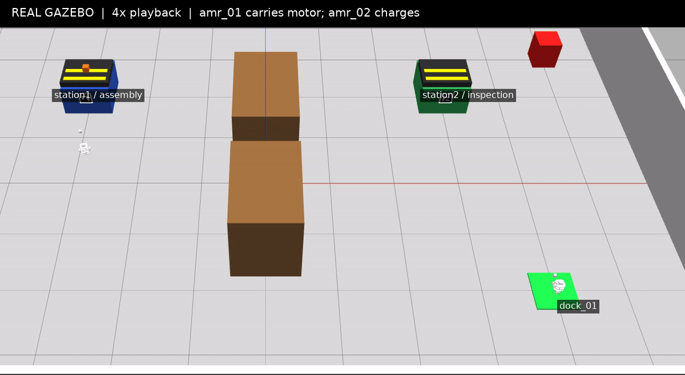
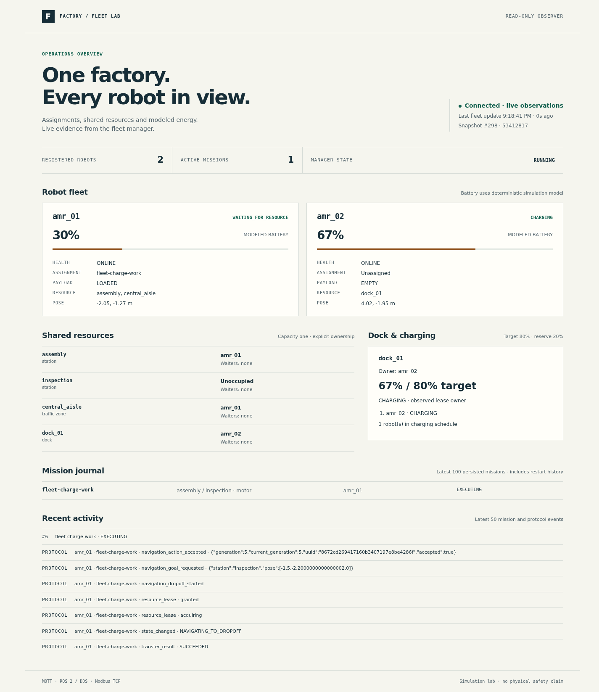
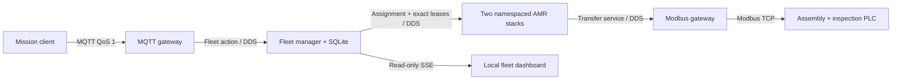
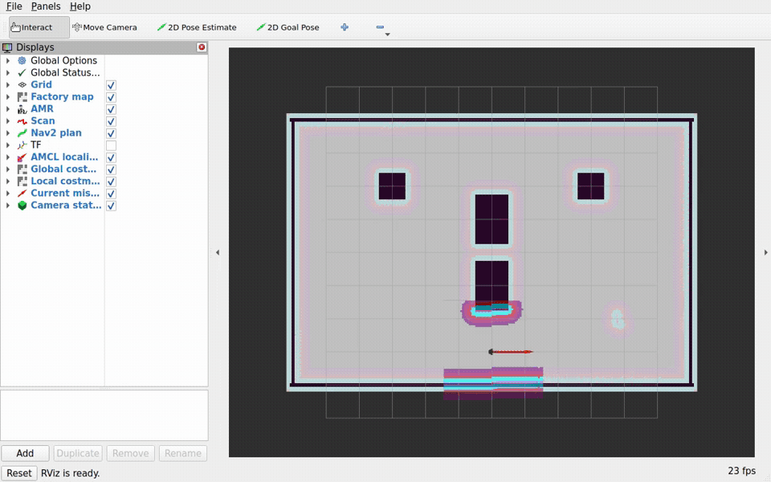
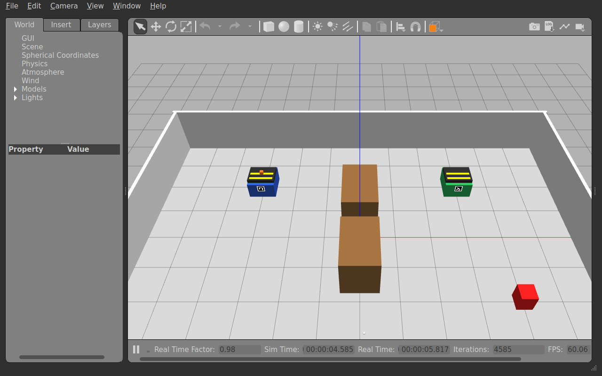
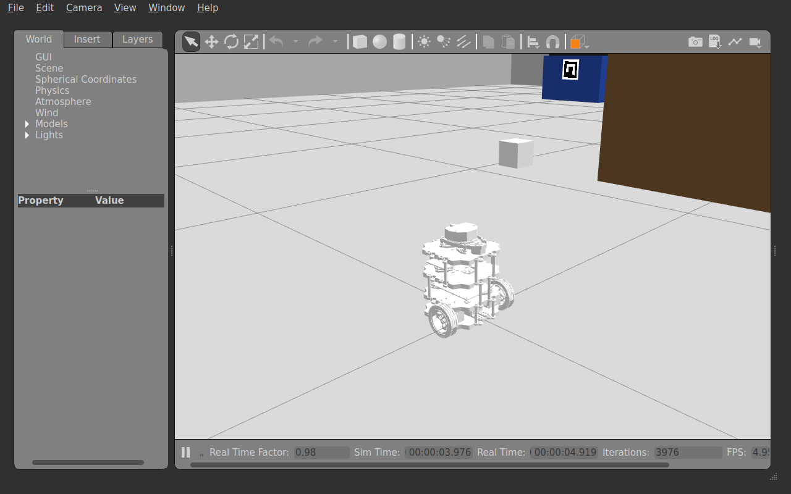

# Factory AMR Protocol Lab

Two simulated AMRs share a factory aisle, assembly and inspection stations,
and one charging dock. A central fleet manager chooses an eligible robot by
path cost, keeps exact resource leases, and journals missions in SQLite. Each
robot keeps its own Nav2, localization, camera, battery and execution stack.
MQTT is the mission boundary; ROS 2 DDS is the robot boundary; Modbus TCP is
the station boundary. This is a simulation project, not a physical safety system.



Orange motor travels on `amr_01` from the blue assembly bench to the green
inspection bench while `amr_02` charges on the green dock. This is real Gazebo
window capture at 4× playback, not generated motion or a dashboard animation.



The read-only dashboard shows robot identity, modeled battery, payload,
assignment and capacity-one ownership. Lease credentials are not published.
See [capture provenance and measured proof](docs/validation/latest-results.md#fleet-evidence-8-october-2026).

## Fleet quick start

After the dependency setup below and `colcon build --symlink-install`, start
the automatic demonstration in one command:

```bash
DISPLAY=:0 scripts/run_fleet_demo.sh
```

Within the first minute the dashboard and both robot stacks start. The full
run takes several minutes: one robot charges from 25% to 80% while the other
delivers a motor. The working robot subsequently charges on a distinct dock
lease after the first robot exits safely, then two automatic missions run in a
fresh world. Each run
prints its local dashboard URL and unique artifact directory. Ctrl+C stops
only processes and services created by that run. `--headless` omits Gazebo
windows; rendered camera detection still needs a working display.

The fleet supports two full Gazebo/Nav2 stacks. Ten synthetic DDS agents prove
registration, heartbeat, cost, deterministic assignment and bounded completion;
ten simultaneous Gazebo worlds or physical robots are not claimed. Adding an
agent changes configuration rather than scheduler or robot-specific branches.
Lease-enabled routes currently support one traffic segment per station leg.
Multi-segment routes are rejected until protected handoff bays exist; this is
a route-geometry limitation, not a robot-count limit.
More than two physical contenders need distinct protected waiting bays; the
supplied waiting layout is not a ten-robot Gazebo safety claim.
Dock exits use dedicated configured bays. Only the demonstrated assembly-to-
inspection direction has validated post-mission dock approaches; free-floor
travel relies on Nav2 obstacle avoidance, not general multi-agent path planning.
Each simulated robot has one part lifecycle; each acceptance scenario starts
a fresh world. Battery percentages come from a deterministic simulation model.

```bash
scripts/run_ci_checks.sh
DISPLAY=:0 scripts/run_fleet_acceptance.sh --headless --scenario all --timeout 900
```

The first command runs the local non-Gazebo gate, including a real browser and
ten-agent DDS proof. The second explicitly runs real two-robot Gazebo/Nav2,
MQTT and ownership-enabled Modbus scenarios plus robot-failure and scale proof.
Receipts include exact leases, sampled world poses, fleet snapshots and child
exit status. Current fleet changes require their own hosted workflow result;
the previously observed hosted result below belongs to Version 1.

See [fleet operations](docs/fleet-operations.md) for failure semantics,
artifact anatomy, process ownership and troubleshooting. The implementation
runs on Ubuntu 22.04/ROS 2 Humble with Gazebo Classic, a rendering display,
Docker and local build tools. Two Nav2 stacks are a laptop workload; CPU,
graphics-driver and memory constraints can lengthen startup and execution.
Dependencies and initial build are not included in the 60-second startup.
The local evidence machine has 16 logical CPU threads and 16 GiB RAM with a
working graphics driver. This is an observed test platform, not a guaranteed
minimum; software rendering or memory pressure can exceed the bounded deadline.



## Version 1 evidence and compatibility

The following recording and source-bound results document the original
single-robot path. Its pinned `amr_01` JSON request remains valid through the
fleet boundary; the original `scripts/run_demo.sh` command is retained.

A ROS 2 Humble simulation of a mobile robot carrying a motor part from assembly
to inspection. Nav2 and AMCL navigate on a committed map, a rendered RGB camera
confirms ArUco markers, MQTT accepts missions, and real Modbus TCP handshakes
control the simulated PLC. Gazebo animates conveyors and payload. The observer
writes a JSONL trace and a mission report.



The real Gazebo recording shows pickup and drop-off at captured wall speed, with
robot transport at 4× wall speed. The crop follows the orange payload so its
ride on the robot remains visible. All frames come from the application window;
no intermediate frames are generated.





This separate close-up verifies installed robot mesh resolution after its search
path correction. The overview retains its earlier source revision; the close-up
does not claim another completed mission.

MQTT connects the dispatcher to the robot with validated JSON and replayable
status. ROS 2 DDS carries typed actions, services, fresh sensor observations,
and correlated events inside the robot. Modbus TCP connects the transfer adapter
to deterministic PLC station registers. Each protocol has a separate owner and
a different completion guarantee.


See [measured validation results](docs/validation/latest-results.md) for capture
provenance, mission timing, revision boundaries, and the earlier fault matrix.

## Setup and demo

Use Ubuntu 22.04, ROS 2 Humble, Python 3.10+, Gazebo Classic, Nav2, TurtleBot3,
OpenCV with ArUco, Docker Engine, and Docker Compose v2. Install `python3-venv`,
`python3-colcon-common-extensions`, and `python3-rosdep`. Initialize rosdep once
with `sudo rosdep init` if needed, run `rosdep update`, and allow your user to
access Docker. Set up the recorded project dependencies:

Ubuntu's `python3-opencv` 4.5.4 provides the required ArUco module. Detection and
marker generation support its API and newer OpenCV releases. The demo disables
Python user-site packages and uses the system ROS/OpenCV packages plus the owned
`.venv` dependencies; no user OpenCV wheel is required.

```bash
scripts/setup_dev.sh
```

Start the demo from the repository root with a working display:

```bash
DISPLAY=:0 scripts/run_demo.sh
```

The script verifies the environment, starts healthy Compose services, builds
incrementally with `--symlink-install`, and launches Gazebo, RViz, navigation,
perception, and all protocol adapters. Publish in another terminal using the
command printed by the script:

```bash
scripts/send_demo_mission.sh
```

Mission `M-001` loads at assembly marker 10 and unloads at inspection marker 20.
The complete reliable state stream is `RECEIVED`, `NAVIGATING_TO_PICKUP`,
`VERIFYING_PICKUP`, `LOADING`, `NAVIGATING_TO_DROPOFF`, `VERIFYING_DROPOFF`,
`UNLOADING`, `COMPLETED`. Each station requires five fresh detections within
1.5 seconds, current navigation success, and agreeing AMCL localization before
transfer. Payload states are `AT_ASSEMBLY`, `IN_TRANSIT`, `AT_INSPECTION`.
Sending the same mission again replays its final MQTT status without another
execution or PLC cycle. Humble can omit initial action feedback; reliable state
and protocol streams retain the complete order.

Press Ctrl+C to stop. Cleanup stops only the script's launch process group and
its newly created Compose project. A supplied preexisting project is reused
only when both services are healthy and is preserved on exit. Host ports bind
to localhost and default to MQTT 1883 and Modbus 1502. For concurrent demos,
set distinct `FACTORY_MQTT_PORT`, `FACTORY_PLC_PORT`, and
`FACTORY_COMPOSE_PROJECT`; use the same MQTT port with the mission publisher.
The script explicitly defaults to isolated ROS domain 80 regardless of the
caller's `ROS_DOMAIN_ID`. `FACTORY_ROS_DOMAIN_ID` permits an explicit integer
from 1 to 232. Concurrent robots must use distinct domains. Each run chooses a
local Gazebo master and a fresh trace directory, printed at startup.

Use `DISPLAY=:0 scripts/run_demo.sh --headless` to omit GUI windows. RGB
rendering still requires a working display. `FACTORY_OUTPUT_DIR` selects the
observer directory; give each observer its own directory. The trace is
`protocol_events.jsonl`; report names use the full SHA256 of the UTF-8 mission
ID. See [architecture](docs/architecture.md) and [protocol contracts](docs/protocols.md)
for components, RViz topics, schemas, registers, retries, and limitations.

## Verification

Run the same non-Gazebo gates locally and in GitHub Actions:

```bash
scripts/run_ci_checks.sh
```

Run `scripts/setup_dev.sh` once to install the pinned Ruff 0.15.7 and
clang-format 14.0.6 tools in `.venv`. Install Ubuntu 22.04's `cppcheck` package
(2.7), and provide a working Docker daemon. The runner sources ROS 2 Humble and
the project environment, requires `.venv` colcon 0.20.1 and the recorded runtime
pins, and explicitly sets `ROS_LOCALHOST_ONLY=1` and `PYTHONNOUSERSITE=1`.
Each stage prints RUN/PASS/FAIL. The first failed stage stops the runner and
preserves its exit code; the success line appears only after every stage passes.

The gates check Python formatting and lint, C++ formatting and correctness/
portability lint, a symlink build of all 12 ROS packages, package tests and fresh
colcon results, pure Python tests, ROS interface contracts, MQTT JSON schemas,
and real Mosquitto/Modbus integration fixtures. C++ performance suggestions are
advisory and are not part of the blocking lint categories. Colcon restricts
Python discovery to each package's `test` directory and excludes the rendered
camera and Gazebo payload tests; CTest excludes the simulation-topic and
navigation-goal and two-robot fleet launch tests. The runner also checks bounded
fleet/failure/ten-agent behavior and the real dashboard browser. Each run prints
a unique `artifacts/ci/<run-id>/` directory containing its fresh build, install,
logs and `test-results`. Test generation and result inspection use that exact
root; the remaining stages source that fresh install. Existing local result
files are preserved. A bare result scan of an old `build/` tree can include
historical RED runs and is not current verification. The protocol fixtures own
ephemeral loopback services and verify
cleanup. Their bounded navigation driver is not physical autonomy coverage.
The additional QoS/reset tests use actual DDS and ROS service endpoints, without
starting Gazebo.

The workflow uses Ubuntu 22.04, provisions ROS/platform dependencies, and then
calls `scripts/setup_dev.sh` and this exact runner. These provisioning steps are
CI-only setup; they do not add another test selection. GitHub success requires
an observed workflow run on the pushed commit and is not implied by local PASS.

Full Gazebo, physical success/autonomy tests, and the complete scenario matrix
remain **local-only**. With a working display, run:

```bash
set -e
source .venv/bin/activate
source /opt/ros/humble/setup.bash
export PYTHONNOUSERSITE=1 ROS_LOCALHOST_ONLY=1
mkdir -p artifacts
verification_root=$(mktemp -d "$PWD/artifacts/full-verification.XXXXXX")
colcon --log-base "$verification_root/log" build --symlink-install \
  --test-result-base "$verification_root/test-results" \
  --build-base "$verification_root/build" --install-base "$verification_root/install"
source "$verification_root/install/setup.bash"
export FACTORY_INSTALL_SETUP="$verification_root/install/setup.bash"
DISPLAY=:0 colcon --log-base "$verification_root/log" test --executor sequential --return-code-on-test-failure \
  --build-base "$verification_root/build" --install-base "$verification_root/install" \
  --test-result-base "$verification_root/test-results" --event-handlers console_direct+
colcon test-result --verbose --test-result-base "$verification_root/test-results"
DISPLAY=:0 .venv/bin/python3 -m pytest -q tests
DISPLAY=:0 timeout 300s python3 -m pytest -q tests/system/test_successful_mission.py -s
git diff --check
```

The system test runs actual Gazebo motion, AMCL/Nav2, rendered camera detection,
an owned broker and PLC, and MQTT mission delivery. It checks exactly one
execution, both PLC counters, payload transitions, final independent world and
localization poses, duplicate suppression, and observer artifacts. The direct
success probe defaults to domain 80. Fleet and Version 1 scenario runners and
restart fixtures share cross-process locked domains in 20–69, excluding the
inherited domain and unsafe host UDP port ranges. Standalone physical package
probes use explicit isolated domains. Services, ports, Gazebo master, and
output directory are isolated per run.

Keep package tests in the unrestricted colcon command above. ROS launch_testing
imports test modules by basename, and different packages intentionally have
their own `test_node` modules and helpers. A monolithic `tests src/*/test`
pytest invocation merges those namespaces and is not a valid repository gate.
Unrestricted colcon tests every package in its own process; the following
repository-level pytest command tests all top-level suites without omitting
any package coverage or disabling launch_testing.

## Repeatable fault scenarios

Run one scenario or the complete 12-case matrix after setup and a successful
`colcon build --symlink-install`:

```bash
DISPLAY=:0 scripts/run_scenario.sh success
scripts/run_scenario.sh mqtt_disconnect
scripts/run_scenario.sh modbus_timeout
DISPLAY=:0 scripts/run_scenario.sh wrong_marker
DISPLAY=:0 scripts/run_scenario.sh nav_retry
DISPLAY=:0 scripts/run_all_scenarios.sh
```

Each case writes actual behavior, correlated trace assertions, and command logs
under `reports/<run-id>/<scenario>/`. Exit zero means both the expected final
state and trace assertions match. The default deadline is 300 seconds per case;
`FACTORY_SCENARIO_TIMEOUT` sets a positive number of seconds. Timeout returns
124, interruption returns 130 or 143, and a failed scenario command preserves
its exit code. Cleanup can take up to 65 additional seconds after a deadline.
`FACTORY_REPORT_ROOT` selects a report root. Matrix runs create `summary.json`
and `summary.md` and continue after unexpected outcomes.

Success, wrong marker, navigation retry, and navigation failure use real Gazebo.
Protocol fault cases use actual MQTT/ROS/Modbus peers and a bounded navigation
action driver. QoS mismatch is a separate DDS experiment. Every case starts
fresh resources and resets its controls. See [measured fault scenarios](docs/fault-scenarios.md)
for names, evidence, and transport lessons. Full Gazebo verification requires
a local rendering display; it is not claimed as CI coverage.

## Version 1 limitations

Version 1 has one robot, one motor part, and one fixed route. Conveyor motion is
a bounded visual animation after a confirmed PLC cycle; there is no manipulator
or physical grasp simulation. After loading, the payload rides on top of the
robot as a robot-relative visual pose, then moves onto the inspection belt for
unloading. Registries are process-local. MQTT and
Modbus bind to localhost without production authentication. Optional MQTT
authentication through an ignored password file is deferred and is not delivered;
the supported broker default is anonymous and loopback-only. The hosted CI is
observed passing, but it excludes local-only Gazebo rendering and navigation.

Vanished or hung transfer gateways can leave
a stopped robot with a pending mission and unknown PLC state. No bound on
every mission or crash recovery is claimed. Restart the simulation to reset
the single-part lifecycle. After confirmed pickup, or a request whose outcome
cannot safely exclude pickup, another valid mission
returns `FAILED/RESTART_REQUIRED` without moving or transferring, even if the
first mission later fails, is canceled, or loses cleanup acknowledgement.
Only proven pre-request failures permit a new mission; identical MQTT IDs still replay their recorded status.
The guard is process-local: restart the full demo rather than only the coordinator.

The world retains a controllable non-static obstacle. Obstacle-triggered physical
replanning/recovery coverage is deferred and is not delivered. Navigation recovery
evidence instead uses explicit Nav2 adapter rejection, real costmap clears, and
retry of the same leg.

The tested Gazebo model path resolves the AMR meshes but exposes unrelated ROS
share packages to the model browser. A retained GUI receipt contains 407
missing-`model.config` diagnostics. This known browser noise is separate from
actual mesh-resolution failures and is not a diagnosed Gazebo crash cause.

The source-bound Version 1 GUI receipt at development revision
`6b4f300f64cbd22270f69722278df0d083904340` records 24/24 zero child exits. It
includes a production shutdown correction covered by focused lifecycle tests.
An earlier attempt at revision `f47a4b779c90c17ae3fdf53416e98d8361726433`
left a missing visualization exit status and failed public cleanup; a separate
reader diagnostic raised a shutdown `RuntimeError`. Two standalone close-up
receipts also record Gazebo-client `SIGSEGV` during diagnostic teardown. Those
historical causes remain unknown. A supported-path client SIGSEGV blocks release;
the current pass does not prove lifecycle reliability on every graphics stack.
See [source-bound validation](docs/validation/latest-results.md) for retained
failures, exact clocks, correction scope, and the passing receipt.

Licensed under Apache-2.0. See [LICENSE](LICENSE).

Shutdown exception policy remains localized in ROS entry points. Keep each guard
narrow: inactive context and the exact observed shutdown error only. Active
context and unrelated errors must remain visible.
