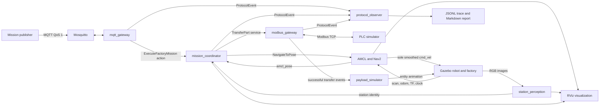

# Architecture and successful mission

The lab separates mission decisions from communication transports and Gazebo
APIs. All robot nodes share simulation time. The committed map and station
poses share world coordinates.



Only the Gazebo drive plugin publishes wheel odometry and `odom` to
`base_footprint`. Robot state publication owns the remaining robot TF tree.
AMCL owns `map` to `odom`. Nav2 controller and recovery behaviors feed the
velocity smoother; only its output publishes `/cmd_vel`. Gazebo entity service
access stays in simulation packages.

| Package | Responsibility |
| --- | --- |
| `factory_interfaces` | Typed mission action, transfer service, station detection, protocol events |
| `mission_coordinator` | C++ state machine, current-goal navigation, localization and camera gates, transfer sequencing |
| `mqtt_gateway` | JSON validation, mission registry, action bridge, status and telemetry buffering |
| `modbus_gateway` | Unit mapping, PLC handshake retries and cleanup, exact transfer events |
| `plc_simulator` | Standalone deterministic TCP PLC: assembly unit 1 and inspection unit 2 |
| `station_perception` | OpenCV ArUco detection from RGB images, preserving source timestamps |
| `payload_simulator` | Deduplicated transfer state, conveyor and part animation |
| `protocol_observer` | Passive JSONL trace and terminal duration report |
| `factory_simulation` | World, Burger-compatible drive, LiDAR, RGB camera, IMU, odometry, entity probes |
| `factory_bringup` | Map, station configuration, AMCL/Nav2, full composition, RViz visualization |

## Mission sequence

```mermaid
sequenceDiagram
    participant D as Dispatcher
    participant M as MQTT gateway
    participant C as Coordinator
    participant N as AMCL/Nav2
    participant V as Camera perception
    participant G as Modbus gateway
    participant P as PLC
    participant B as Payload simulator
    participant O as Observer
    D->>M: Standard M-001 JSON, QoS 1
    M->>C: ExecuteFactoryMission
    C-->>M: Goal accepted
    M-->>D: RECEIVED
    C->>N: Assembly [-3, 0.8, pi/2]
    N-->>C: Current goal succeeds; current-leg AMCL agrees
    V-->>C: Five fresh marker 10 images within 1.5 seconds
    C->>G: Load motor at assembly
    G->>P: Part code, robot_present, transfer_request
    P-->>G: Completion flag and changed counter
    G-->>B: One successful LOADING cycle event
    B-->>B: IN_TRANSIT; animate assembly conveyor
    G-->>C: Safe handshake result
    C->>N: Inspection [3, 0.8, pi/2]
    N-->>C: Current goal succeeds; current-leg AMCL agrees
    V-->>C: Five fresh marker 20 images within 1.5 seconds
    C->>G: Unload motor at inspection
    G->>P: Part code, robot_present, transfer_request
    P-->>G: Completion flag and changed counter
    G-->>B: One successful UNLOADING cycle event
    B-->>B: AT_INSPECTION; animate inspection conveyor
    G-->>C: Safe handshake result
    C-->>M: COMPLETED
    M-->>D: COMPLETED, error_code null
    C-->>O: Terminal event
    O-->>O: Write report; refresh for late correlated events
    D->>M: Identical M-001 again
    M-->>D: Replay COMPLETED without another action
```

Each verification leg resets its confirmation window. Marker 10 identifies
assembly; marker 20 identifies inspection. Transfer requires current goal
success, a finite current-leg map-frame AMCL pose within 0.25 m and 0.25 rad,
and five increasing correct image timestamps within 1.5 seconds. Stationary
AMCL updates can be sparse; camera evidence still expires against simulation
time. Only the Modbus adapter owns transfer phase pairs. Successful finish
details carry station, `LOADING` or `UNLOADING`, and the actual uint16 counter.
Payload deduplication uses mission, transfer kind, and counter. Observer sequence
numbers record local arrival; source timestamps use simulation time. Reports
refresh for late correlated events because cross-publisher DDS delivery can
follow service completion.

Sensor observations may arrive before their corresponding `/clock` update.
The coordinator retains one current-leg AMCL candidate and at most five pending
camera observations. It processes camera observations only after their source
timestamps are current, then applies the same identity, order, freshness, and
window checks. Invalid observations clear partial confirmation; each leg and
terminal reset clears pending evidence. No future evidence permits a transfer.
The action result owns the terminal MQTT status, including its final error code;
terminal feedback does not publish an additional completion.

## Running and observing

Run `scripts/setup_dev.sh` once, then `DISPLAY=:0 scripts/run_demo.sh`.
Publish with `scripts/send_demo_mission.sh` in a second terminal. The standard
mission is `M-001`, `amr_01`, assembly pickup, inspection dropoff, motor.
See the [README](../README.md) for setup, port/domain overrides, cleanup,
headless operation, expected states, and verification commands.

RViz uses fixed frame `map`. It displays `/map`, `/amcl_pose`, `/scan`, both
costmaps, `/plan`, `/factory/navigation_goal`, `/factory/station_markers`, and
the robot. The visualization adapter derives goals from coordinator navigation
events and committed station poses. Camera identity labels sit at configured
station locations and expire after 1.5 seconds. These labels show observed
identity, not measured 3D marker position. Initial-pose and goal tools are available.

On success the robot ends within 0.25 m and 0.25 rad of inspection. Each PLC
counter increments once, robot-owned presence/request coils clear, and the
part rests at world `(3, 2, 0.65)`. MQTT emits `COMPLETED` once for the original
request; duplicates replay that status. The printed output directory contains
`protocol_events.jsonl` and, for `M-001`,
`mission_02acf5bdbbaa226dc29a07a86e64c1b2d630385779533ed70d193a8c258149dc.md`.

## Current limitations

Version 1 supports one robot, one motor part, and one fixed route. Resetting the
single-part lifecycle requires restarting the simulation. Registries and active
aggregation are process-local. Restart recovery, reliability scenarios, CI,
and publication remain later work.

A vanished or hung gateway after transfer dispatch can leave the mission
pending with the robot stopped and PLC state unknown. Cancellation during
transfer requires an explicit safe handshake outcome. No bound on every
mission or crash safety is claimed. The system test has a 300-second outer
deadline and stops only its owned harness. Payload visual failures are best
effort and do not undo confirmed logical transfers.

Humble clients can omit initial action feedback before registering the accepted
goal. Complete reliable mission-state and protocol-event streams are authoritative.
Headless RGB still requires a working display. Localhost MQTT and Modbus have
no production authentication or production security model.

The installed Humble RViz renderer can log a first-map GLSL sampler diagnostic
(`active samplers with a different type refer to the same texture image unit`),
also reported in [upstream RViz issue 463](https://github.com/ros2/rviz/issues/463).
The actual RViz view on the verified display shows the map, localization,
scan, both costmaps, plan, goals, and live station identity labels despite this
diagnostic. Rendering on every graphics driver is not guaranteed.
